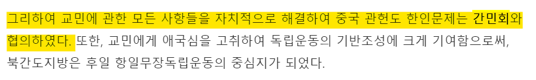

# :key: NER-For-Keyword Extraction :tipping_hand_woman:

### Named Entity Recognition for Keyword extraction from Online lecture

"온라인 학습자를 위한 교육 도우미 < PLUS >" 의 두 번째 기능인 '키워드 추출'을 위한 repo입니다.

</br>

* ### :books: 온라인 학습자를 위한 교육 도우미 < PLUS >

  쌍방향 소통의 한계를 가진 비대면 온라인 학습 상황에서 스스로 공부해야하는 학습자를 돕는 교육 도우미 < PLUS >를 개발하였습니다.

  교육자의 발화를 기반으로 학습된 모델이 질문에 대한 답을 제공해주고, 강의 내용 중 중요한 키워드를 실시간으로 추출하여 제공합니다.
  </br>

  **1 ) 핵심 키워드 추천**

  ```javascript
  "방금 교수님이 말씀하신 그 단어, 처음 들어보지 않아 ? 한국사에선 기관/회담 이름이 중요하잖아 ! 무슨 뜻인지 읽어봐 ! "
  
  1. BERT 모델이 강의자의 발화에서 개체명을 추출합니다.
  2. 한국사에서 중요한 의미를 갖는 개체명만을 추출합니다.
  3. tf-idf score가 가장 높은 단어를 골라 단어의 정의를 크롤링하여 제공합니다.
  ```
  </br>

  **2 ) 강의 중 Question & Answer**

  ```javascript
  "아까 그거 뭐였더라 ? 강의에 방해되는 질문은 PLUS에게 물어봐 !"
  
  1. 강의 중 궁금한 질문이 생긴 학생이 질문을 입력합니다.
  2. 교육자의 실시간 발화에서 질문에 대한 답을 찾아 제공합니다.
  ```
  </br>

* ### 🔑 사용 기술 관련 키워드

  - BERT
  - Named Entity Recognition
  - TF - IDF
  - Knowledge Distillation
  - Conditional Random Field
  - pytorch
  </br>

* ### 🙋🏻‍♀️ 역할

  - NER 모델 구현 및 성능 향상을 위한 실험
  - KoBert와 CRF층을 결합한 NER 모델 구현 및 성능 향상을 위한 실험
  - 태깅된 개체명을 기반으로 TF-IDF를 이용하여 키워드를 추출하는 알고리즘 구현
  </br>

* ### 💻 개발 환경

  - 사용 언어 : Python3
  - 개발 환경 : Linux, Colab Pro, Pycharm
  - 진행 기간 : 2020.05.11 ~ 2020.06.05
</br>

## :raising_hand_man: Idea와 흐름 엿보기

주어진 글 속에서 **중요한 단어 / 모를만한 단어**를 어떤 기준으로 추출할 수 있을까?

TF-IDF와 같이 등장 빈도를 기반으로 중요한 단어를 추출할 수 있다.

그러나 도메인에 따라 **"해당 개체명이 갖는 의미"** 역시 중요도에 영향을 줄 것이라고 판단하였다.

생명 과학에 관련된 문서에서는 <동물> , <식물 > 이 의미를 갖지만, 한국사에서는 이보다는 <인명> 이 더 중요한 단어일 가능성이 크다.

개체명을 추출하고 **개체명의 의미를 파악하여 단어를 추출**한다면? 도메인에 더 꼭 맞는 단어 추출이 가능할 것이라고 판단하였다 !

</br>

큰 흐름은 다음과 같다.

</br>

#### :man_teacher: 1. 교육자의 발화가 Speech To Text를 통해 text 형태로 변환되어 입력된다.

```
공민왕이 시해되면서, 칼에 맞아 죽게 되면서 그 개혁의 배턴을 누가 이어받느냐면 신진사대부가 이어받게 될 겁니다.
그래야 호족, 문벌귀족, 무신, 권문세족, 신진사대부. 그 맥이 이어질 테니까요. 됐죠? 이게 바로 고려 오백 년의 흐름이에요.
기억나시죠? 좋습니다. 그렇다면 이제 다음 챕터로 대외 관계를 볼게요. 고려는 외침이 정말 많았던 나라입니다.
거란족의 침입, 여진족의 침입, 몽골의 침입, 홍건적과 왜구의 침입. 정말 많았거든요.
그 외침의 역사를 지금부터 하나씩 하나씩 볼 텐데 고려 파트에서 문제 두 문제 나온다고 그랬죠?
```

</br>

#### :robot: 2. 키워드 추출 모델이 개체명을 추출하고 정제한다.

```
개체명을 추출해보자 ...
	=> 공민왕, 신진사대부, 호족, 문벌귀족, 무신, 권문세족, 고려, ...
TF-IDF를 통해 파악한 중요 단어 리스트와 한국사에서 특히 의미를 갖는 개체명 리스트를 교집합해보자 ...
	=> "권문세족"이 중요해보여 !
```

</br>

#### :books: 3. 추출된 단어와 정의를 학습자에게 제공한다.

```
권문세족 : 고려후기 정치세력으로 고려 전기의 문벌귀족, 조선의 양반사대부와 비견되는 지배층.권문세가.
```

</br>

## :open_file_folder: Train Data / Test data

NER 대회용 데이터와 한국민족문화대백과사전에서 스크래핑한 데이터를 섞어 train/test를 실시했다.

</br>

### 1 ) [Naver/창원대 NLP Challenge](http://air.changwon.ac.kr/?page_id=10)

네이버와 창원대학교에서 주최한 NLP Challenge에서 제공하는 학습 데이터이다.

데이터 형식은 다음과 같고,  총 14개의 개체명 태그가 존재한다.

```
0	나는	-
1	창원대학교에서	LOC_B
2	열린	-
3	대동제를	EVT_B
4	구경하러	-
5	갔다.	-
```

1. `PERSON`	PER	실존, 가상 등 인물명에 해당 하는 것
2. `FIELD`	FLD	학문 분야 및 이론, 법칙, 기술 등
3. `ARTIFACTS_WORKS`	AFW	인공물로 사람에 의해 창조된 대상물
4. `ORGANIZATION`	ORG	기관 및 단체와 회의/회담을 모두 포함
5. `LOCATION`	LOC	지역명칭과 행정구역 명칭 등
6. `CIVILIZATION`	CVL	문명 및 문화에 관련된 용어
7. `DATE`	DAT	날짜
8. `TIME`	TIM	시간
9. `NUMBER`	NUM	숫자
10. `EVENT`	EVT	특정 사건 및 사고 명칭과 행사 등
11. `ANIMAL`	ANM	동물
12. `PLANT`	PLT	식물
13. `MATERIAL`	MAT	금속, 암석, 화학물질 등
14. `TERM`	TRM	의학 용어, IT곤련 용어 등 일반 용어를 총칭

</br>

* #### NOTE

  * `index`는 새로운 문장이 시작될 때마다 1로 초기화된다.
  * `tag`의 앞부분은 개체명의 의미를, 뒷부분은 BIO tagging을 뜻한다.
    * B는 개체명의 시작 어절, I는 끝 어절, -는 개체명이 아닌 어절을 뜻한다.
    * ex ) `맨체스터 유나이티드` => `맨체스터`에는 `ORG_B` 가, `유나이티드` 에는 `ORG_I`가 부여된다.
  * 두 개체명이 조합된 경우, 앞에 등장하는 개체명을 따라 태그를 부여한다. 
    ex ) 포항공과대학교(LOC_B) 컴퓨터공학과(ORG_B) => LOC로 부여

</br>

### 2 ) [한국민족문화대백과사전](https://encykorea.aks.ac.kr/)

한국민족문화대백과사전에서 스크래핑을 통해 train set을 만들었다.

</br>

##### :a:. `(의미, 개체명, 문장)` 생성하기

먼저 사이트의 구조는 다음과 같다.

```
한국민족문화대백과사전

├ 1. 분야(Category)별 단어 검색
│    ├ 경제/산업
│    ├ 과학
│    ├ 교육
│    ...
│
└ 2. 유형(Type)별 단어 검색
     ├ 인물
     ├ 지명
     ├ 문화재
     ├ 유물
     ├ 단체
	 │	├ 간민회 : 간민회란 ... 그리하여 교민에 관한 모든 사항들을 자치적으로 해결하여 중국 관한도 한인문제는 간민회와 협의하였다. ...
	 │	└ 강구회 : 1920년대 초 만주에서 ...
     │ 
     │ ...
     │
     └ 동/식물
```

</br>

다음 규칙에 따라 `(의미,개체명,문장)` 쌍을 생성한다.

1. **개체명의 의미**는 `2. 유형(Type)별 단어 검색` 의 `유형` 분류에 적힌 것을 기준으로 `1 ) Naver/창원대 train set`에 제시된 12개의 tag 중 하나로 적용한다.
   * ex ) `단체` 카테고리에 속하는 `간민회` , `강구회` 등의 단어는 정답 tag는 `ORG`로 약속한다.

2. **개체명**은 `유형` 분류에 들어가 스크래핑 한다.
   * `ORG`가 정답 tag인 개체명 데이터셋을 생성하기 위하여 `유형별 단어 검색 > 단체`  에 들어가 단어를 고른다.
   * 모든 카테고리를 가져오지는 않았다. `"유물","유적","작품","제도","지명","문헌","단체","문화재"` 를 이용했다.

3. **문장**은 해당 개체명의 설명 페이지(아래 그림)에서, 개체명이 들어간 문장을 고른다.
   * `간민회`의 상세 설명 페이지에서 `간민회`가 들어간 문장(두번째 그림)을 추출한다.

</br>


</br>



</br>

##### :b:. 개체명 Tagging하기

현재 상태는 `(ORG, 간민회, 그리하여 교민에 관한 모든 사항들을 ... 간민회와 협의하였다.)` 형태이다.

그러나 모델에 학습시키기 위해서는, `간민회`이외의 `교민`, `중국` 등의 개체명에도 정답 tag를 달아줘야 한다!!

우리가 일일이 태깅하는 방법 말고, 빠르면서 비교적 정확한 방법이 무엇이 있을까 고민 끝에, 다음 방법으로 태깅하기로 하였다.

</br>

:bulb: true tag가 달리지 않은 `교민`, `중국`, `관헌도 `등은 **기존의 model(acc 97%)를 이용하여 약한 정답**을 생성한다 !

* **기존 모델에 의한 정답**  `교민` : `PER` , `중국` : `LOC` , `관헌도` : `LOC`  ,`간민회` : `-`

* **스크래핑으로 생성한 정답**  `교민` : `-` , `중국` : `-` , `관헌도` : `-` ,  `간민회` : `ORG_B`

**=> 최종 모델에 대한 정답** `교민` : `PER` , `중국` : `LOC` , `관헌도` : `LOC`  ,`간민회` : `ORG_B`

</br>

## :robot: Model

Knowledge distillation을 이용하여 [경량화된 DistilKoBERT](https://github.com/monologg/DistilKoBERT)를 이용하였다.

* SKT KoBERT를 경량화 시킨 모델.
* 12개의 layer를 3개로 압축. (각 layer의 초깃값은 기존 모델의 1,5,9번째 weight을 사용했다.)
* 한국어 위키/나무위키/뉴스 등의 10GB 데이터를 이용하여 학습시켰다.

또한 BERT의 output에 CRF층을 결합하여 최종 tag를 분류하도록 하였다.

</br>

##### :thinking: 굳이 DistlBERT를 선택한 이유가 있나요?

우리의 목적은 "실시간으로 교육자의 발화에서 단어를 캐치하는 것"이다. 그렇다면 다음 과정이 필요할 것이다.

1. Speech To Text가 교육자의 발화를 text로 나타낸다.
2. 나타낸 text에서 개체명을 추출한다.
3. 가장 우선순위가 높은 단어를 찾아 단어의 정의와 묶어 학습자에게 제공한다.

이 모든 과정이 실시간으로 빠르게 진행되기 위해서는 추론 시간이 길면 길수록 좋지 않다. 아무리 성능이 좋다고 할지라도 이미 지나간 단어를 뒤늦게 추천해주는 것은 부적절하다고 생각하였다,

그래서 **성능이 조금 낮아질지라도 "빠르게 서비스"하는 것이 더 중요하다**고 판단을 내렸고, **성능을 최대한 유지하면서도 추론시간을 빠르게** 하기 위하여 Knowledge Distillation 개념을 도입하였다.

"DistilBERT, a distilled version of BERT : smaller, faster, cheaper and lighter"(Victor SANH 외 3명, NIPS 2019)"에 의하면, DistilBERT가 BERT 성능의 97%까지 재현하였으며 parameter수와 추론 시간 모두 약 2/3로 줄어들었다.

</br>

## :white_check_mark: 성능 확인

* Accuracy : 0.9069
* 태그별 precision, recall, f1-score 체크


* 한국사에서 중요한 태그라고 생각되는 `PER`, `ORG`, `CVL`, `EVT`에 대해 f1-score는 위와같다. 

* 주로 I tag를 잘 예측하지 못하는데, 이는 한국사 용어 특성상 여러가지 개체명이 결합되어있기 때문에 발생한 현상으로 보인다.

  ##### 특히 LOC_I의 score가 낮은 이유는 다음과 같이 추측해볼 수 있다.

  * 앞 글자가 LOC일 경우, 뒷 글자까지 LOC일 것으로 기대하지만 실제로는 아닌 경우가 많다. 이는 한국사 단어 특성상 여러 개체명이 뭉쳐있기 때문에 발생한다.
  * ex : `강릉농악`에서 `강릉`은 `LOC`이지만 `강릉농악`은 `AFW`
  * 위와 같은 이유로 LOC_I에 대한 규칙이 모호해지면서 예측력이 하락했을 것이다.

</br>

## :page_with_curl: Results

```
공민왕이 시해되면서, 칼에 맞아 죽게 되면서 그 개혁의 배턴을 누가 이어받느냐면 <<신진사대부가>> 이어받게 될 겁니다.
그래야 호족, << 문벌귀족 >>, 무신, << 권문세족 >>, << 신진사대부 >>. 그 맥이 이어질 테니까요. 됐죠?
이게 바로 고려 오백 년의 흐름이에요. 기억나시죠? 좋습니다.
그렇다면 이제 다음 챕터로 대외 관계를 볼게요. 고려는 외침이 정말 많았던 나라입니다.
거란족의 침입, 여진족의 침입, 몽골의 침입, 홍건적과 왜구의 침입. 정말 많았거든요.
그 외침의 역사를 지금부터 하나씩 하나씩 볼 텐데 고려 파트에서 문제 두 문제 나온다고 그랬죠?
```

##### 추천 결과

* '`문벌귀족`': '대대로 내려오는 그 집안의 사회적 신분이나 지위.'

* '`권문세족`': '고려후기 정치세력으로 고려 전기의 문벌귀족, 조선의 양반사대부와 비견되는 지배층.권문세가.'

* '`신진사대부`': '고려·조선시대 문관 관료의 총칭.', '공민왕': '고려후기 제31대(재위: 1351~1374) 왕.'

</br>

```
<< 광종 >>입니다. 과거제, << 노비안검법 >>. 그리고 공복은 앞에서 설명드렸죠.
백제 설명할 때 고이왕 할 때 공복과 관등이라는 것 제가 설명드렸잖아요. 옷 색깔 정하는 것. 그다음에 칭제건원.
‘내가 황제야. 내가 이제부터 연호 쓸 거야.’라고 하면서 자주적인 모습도 바로 이 광종 때 보여 주고 있더라는 얘기입니다.
이렇게 호족들 다 날렸어. 이제 안정을 되찾았겠죠. 이러면서 뭔가 완성시키는 왕이 등장합니다.
항상 완성의 의미를 갖고 있는 왕의 이름은 성종이에요. 조선 시대도 그렇고, 고려 시대도 그렇고.
그래서 성종이 등장을 합니다. 성종은 최승로의 시무 28조 건의를 받아들입니다.
```

##### 추천 결과 

* '`노비안검법`': '고려 광종 때 호족세력을 누르고 왕권을 강화하기 위해 본래 양인이었다가 노비가 된 사람을 안검하여 방량(放良)하게 한 일종의 노비해방법.'
* '`광종`': '고려전기 제4대(재위:949~975) 왕.'

</br>

```
<< 쌍성총관부 >>를 가져갑니다. 철령 이북 지역이거든요. 이 지역을 가져가는 모습들 보이고 있고요.
내정간섭. 정동행성의 이문소를 통해서 내정간섭 심해집니다. 정동행성은 왜 만들었냐면 일본 정벌하기 위해서.
정벌하는 거예요. 동쪽을 정벌하기 위해서 만든 기구라는 얘기인데 정동행성 이문소를 통해서 내정간섭 엄청나게 많이 합니다.
그리고 권문세족들은 정방. 정방 여러분, 기억나요? 기억이 나야지. 앞에서 했잖아.
무신정권 때 최충헌의 아들 최우가 인사권을 장악하기 위해서 만들었던 기구. 이걸 그대로 유지합니다. 왜?
```

##### 추천 결과

* '`쌍성총관부`': '고려 후기 몽고가 고려의 화주(和州) 이북을 직접 통치하기 위해 설치했던 관부.'

</br>

## Reference

* [KoBERT](https://github.com/SKTBrain/KoBERT)
* [DistilKoBERT](https://github.com/monologg/DistilKoBERT)
* [NER](https://github.com/eagle705/pytorch-bert-crf-ner)

